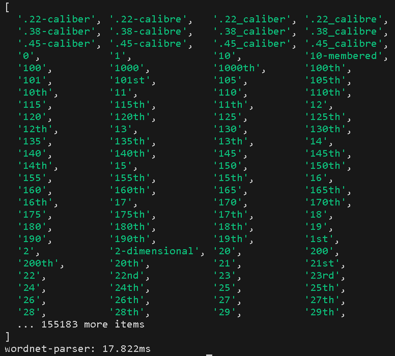
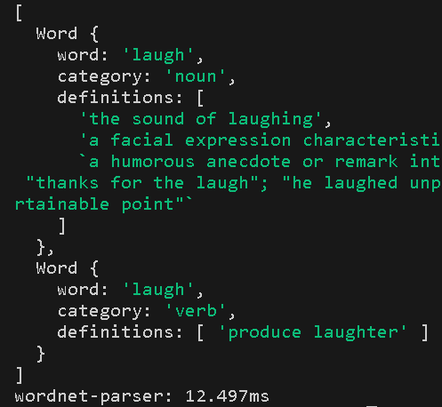
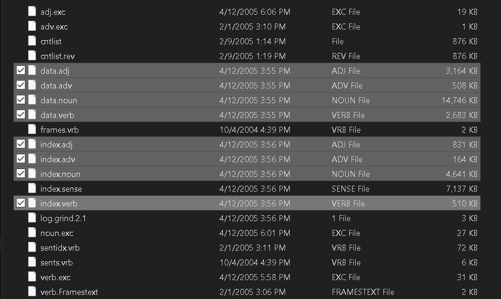

# Wordnet Parser

## The fastest WordNet node API out there ⚡

## What is WordNet?
It is a large database for English words, their definitions, and other lexical information. The project is made by Princeton University.

- [WordNet website](https://wordnet.princeton.edu/)

## API
### Note on DBPATH
First of all: [download the WordNet database files](#downloads)

The api provided below relies on a constant variable called `DBPATH` which is initiliazed as such:
```js
const DBPATH = process.env.DBPATH || "./dict";
```
If your WordNet database is in the root directory of your project you don't need to worry about anything, jump right in to the API. Otherwise if it isn't, you need to create a `.env` file in the root directory of your project and write:
```sh
DBPATH="path/to/dict/folder"
```
### `listWords():void`
This function is memoized using [`memoizee`](https://www.npmjs.com/package/memoizee). Thus it is lightning fast!
```js
listWords()
.then((list)=>{
    console.log(list)
})
// list of all words in WordNet database
```
Output:

In just `17.8ms`!
### `lookup():Promise<Word[] | undefined>`
Uses a memoized map to lookup word. Also blazingly fast!
```js
lookup("laugh")
.then((result)=>{
    if (result !== undefined)
        console.log(result)
})
```
Output: 


In just `12.5ms`!
## Downloads
### linux 
- Database files: [WNdb-3.0.tar.gz](https://wordnetcode.princeton.edu/3.0/WNdb-3.0.tar.gz)
- [What command do I need to unzip/extract a .tar.gz file?](https://askubuntu.com/a/25348)

### windows 
- Download the [WordNet browser, command-line tool, and database files with InstallShield self-extracting installer](https://wordnetcode.princeton.edu/2.1/WordNet-2.1.exe)

- Follow the installation process and make sure you remember the folder where you installed `WordNet`.

- Go to the `dict` folder and copy the highlighted files (below) into a database folder (e.g. name it `dict`) in your project:


## License
- [WordNet License](https://wordnet.princeton.edu/license-and-commercial-use)